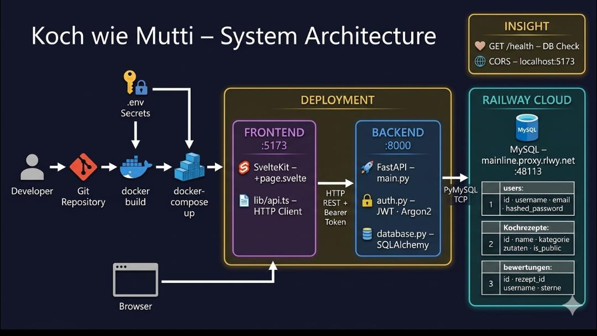

# Projekt-Template – SvelteKit + FastAPI + MySQL

Startpunkt für euer Semester-4-Projekt. Enthält eine lauffähige Boilerplate mit:

- **Backend**: FastAPI + SQLAlchemy + MySQL + JWT-Authentifizierung (Argon2)
- **Frontend**: SvelteKit mit API-Hilfsfunktionen
- **Infrastruktur**: Docker Compose für alle Services


## Set up: 
- Github Repository
- Git runterladen
- Git Acc
- Docker Desktop runterladen

Um die Datenbank zu sehen, bzw zuzugreifen muss man noch Railway mit dem Github repository verknüpfen.

Zum Start der App müssen folgende Extensions Runtergeladen sein:
- Python-Extension-Pack 
- Svelte for VS Code Extension
- Docker DX Extension 
- Github Codespace extension

Repository nach VSCode klonen (https://github.com/d4nielbtw/verteilte-systeme-starter-template)


## Quickstart

```bash
# 1. .env aus Vorlage erstellen und Werte anpassen
cp .env.example .env

# 2. SECRET_KEY generieren im bash generieren(für JWT) – z.B. mit:
openssl rand -hex 32
# Den Output in die `.env`-Datei als `SECRET_KEY` eintragen.

# 3. Alle Services bauen und starten
docker compose up -d --build

# 4. Fertig!
#    Frontend:  http://localhost:5173
#    Backend:   http://localhost:8000
#    API-Docs:  http://localhost:8000/docs
```


Architekturdiagramm:

